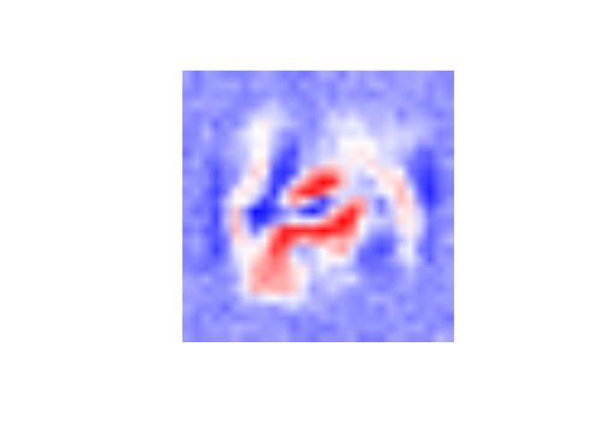

<!-- README.md is generated from README.Rmd. Please edit that file -->

# percept

<!-- badges: start -->
<!-- badges: end -->

The goal of percept is to allow users to easily fit neural network
models to their data.

## Installation

You can install the development version of percept from
[GitHub](https://github.com/) with:

``` r
# install.packages("devtools")
devtools::install_github("hrryt/percept")
```

## Example

This is a basic example of a feed-forward neural network using the MNIST
database:

``` r
library(percept)

read_mnist <- function(file) {
  x <- as.matrix(read.csv(file, header = FALSE, colClasses = "integer"))
  dimnames(x) <- NULL
  x
}

# MNIST data formatted to CSV by Joseph Redmon
mnist_train <- read_mnist("https://pjreddie.com/media/files/mnist_train.csv")
mnist_test <- read_mnist("https://pjreddie.com/media/files/mnist_test.csv")

digits <- 0:9
correct_train <- factor(mnist_train[, 1], levels = digits)
expected_train <- to_categorical(correct_train)
input_train <- mnist_train[, -1] / 255

model <- Sequential$new(list(
  Dense$new(20, Sigmoid),
  Dense$new(20, ReLU),
  Dense$new(10, Sigmoid)
))

system.time(
  model$fit(input_train, expected_train, batch_size=100, epochs=2000, learning_rate=1)
)
#> 200 
#> 400 
#> 600 
#> 800 
#> 1000 
#> 1200 
#> 1400 
#> 1600 
#> 1800 
#> 2000
#>    user  system elapsed 
#>   19.20    1.58   20.96
```

How does the model perform on the test set?

``` r
correct_test <- factor(mnist_test[, 1], levels = digits)
expected_test <- to_categorical(correct_test)
input_test <- mnist_test[, -1] / 255

output_test <- model$feed_forward(input_test)
predicted_test <- to_factor(output_test, labels=digits)
mean(predicted_test == correct_test)
#> [1] 0.9103
```

What does the model look like?

``` r
plot(model)
```


How does each input node tend to contribute to the first hidden layer?

``` r
w <- colSums(model$layers[[1]]$weights)
w <- (w / max(abs(w)) + 1) / 2
colors <- rgb(colorRamp(c("red", "white", "blue"))(w), maxColorValue = 255)
raster <- as.raster(matrix(colors, 28, 28))
plot(raster)
```


